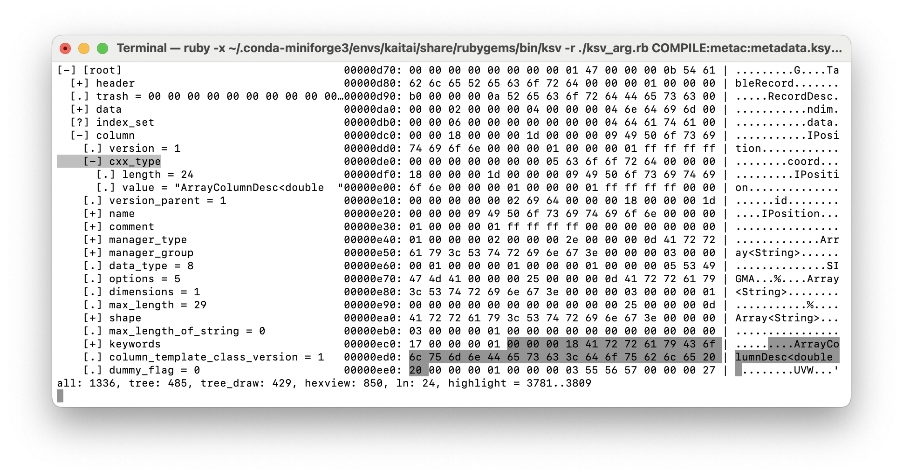

# Support for Parameters in ksv

The Kaitai Struct provides a very nice _curses_ style terminal representation of the layout of a
Kaitai Struct structure. While the [visualizer](https://github.com/kaitai-io/kaitai_struct_visualizer)
can be downloaded directly, it is best to clone
[kaitai_struct](https://github.com/kaitai-io/kaitai_struct.git) with `--recurse-submodules`. This will
provide a complete, consistent set of the Kaitai Struct tools, including the `ksv` visualizer.

ksv's terminal display provides an explorable tree representation of the structure along with
the a byte and string representaitons of the binary file. As the user explores the tree, the
corresponding sections of the byte and string representation are highlighted to show the
source of the structure elements. This is very useful for understanding how binary files are being
parsed:



By default, ksv does not support parameters so it is not possible to _visualize_ the casacore table
storage managers that require information from `table.dat`. However, `ksv_arg.rb`, which is found in this
directory, injects argument handling code into ksv allowing parameterized KSY files to be used.
Arguments are specified by providing the KSY files, loaders and structure access as parameters to the
`ksv` script from the terminal. `ksy_arg.rb` adds three new parameter types:

* **COMPILE**: 
  Used to compile a KSY file and associate it with a symbol. Its usage is `COMPILE:<SYMBOL>:<PATH-TO-KSY>`
  where `<SYMBOL>` is a user supplied string used to refer to the _LOADER_ which is created by compiling
  this KSY file.

* **LOAD**:
  Used to load a binary file using a _LOADER_ created via `COMPILE`. Its usage is
  `LOAD:<SYMBOL>=<LOADER>:<PATH-TO-BINARY>`. This associates the loaded _STRUCT_ representing the parsed
  binary file with this `<SYMBOL>` string.

* **ARG**:
  Specify an argument to be used in the creation of the struct to be visualized. Its format is
  `ARG:<EXPRESSION>` where the expression is evaluated to get the value to be supplied as an argument.
  The order of arguments is preserved. The primary _caveat_ is that the `GET` function should be used
  to access struct fields. Parameters to `GET` should be supplied as strings. The first string is always
  the structure name as defined by the `SYMBOL` supplied to `LOAD`. The remainng arguments are the
  fields which must be accessed to get to the desired value.

This is an example of how these argument types would be used to load a KSY file which has parameters.

```
bash$ ksv -r ./ksv_arg.rb COMPILE:metac:metadata.ksy 'LOAD:meta=metac:ea25_cal_small_before_fixed.split.ms/table.dat' 'ARG:GET("meta","desc","table","columns","column_desc")[0]' ea25_cal_small_before_fixed.split.ms/table.f1 incremental_storage_manager.ksy
```

In this example, `GET` return an array and the first element of the array is used as the parameter value.
